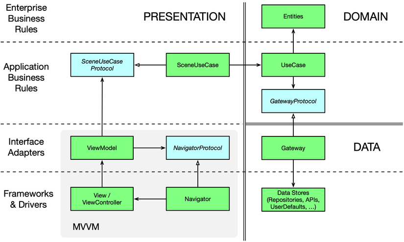

<h1 align="center">Project Structure</h1>

## Documents

<h4 align="center">

 
</h4>

## 🌈 Technical Stack

This project takes advantage of many popular libraries, plugins and tools of the Android ecosystem. Most of the libraries are in the stable version, unless there is a good reason to use non-stable dependency.

The architecture is built around Android Architecture Components.

I followed the recommendations laid out in the Guide to App Architecture when deciding on the architecture for the app. I kept logic away from Activities and Fragments and moved it to ViewModels. I observed data using LiveData and used the Data Binding Library to bind UI components in layouts to the app's data sources.

I used a Repository layer for handling data operations

### Kotlin

I made an early decision to rewrite the app from scratch to bring it in line with our thinking about modern Android architecture. Using Kotlin for the rewrite was an easy choice: I liked Kotlin's expressive, concise, and powerful syntax; I found that Kotlin's support for safety features for nullability and immutability made our code more resilient; and I leveraged the enhanced functionality provided by Android Ktx extensions.

## 🎨 Dependencies

- [Jetpack](https://developer.android.com/jetpack):
  - [Android KTX](https://developer.android.com/kotlin/ktx.html) - provide concise, idiomatic Kotlin to Jetpack and Android platform APIs.
  - [AndroidX](https://developer.android.com/jetpack/androidx) - major improvement to the original Android [Support Library](https://developer.android.com/topic/libraries/support-library/index), which is no longer maintained.
  - [Data Binding](https://developer.android.com/topic/libraries/data-binding/) - allows you to bind UI components in your layouts to data sources in your app using a declarative format rather than programmatically.
  - [Lifecycle](https://developer.android.com/topic/libraries/architecture/lifecycle) - perform actions in response to a change in the lifecycle status of another component, such as activities and fragments.
  - [LiveData](https://developer.android.com/topic/libraries/architecture/livedata) - lifecycle-aware, meaning it respects the lifecycle of other app components, such as activities, fragments, or services.
  - [Navigation](https://developer.android.com/guide/navigation/) - helps you implement navigation, from simple button clicks to more complex patterns, such as app bars and the navigation drawer.
  - [Paging](https://developer.android.com/topic/libraries/architecture/paging/) - helps you load and display small chunks of data at a time. Loading partial data on demand reduces usage of network bandwidth and system resources.
  - [ViewModel](https://developer.android.com/topic/libraries/architecture/viewmodel) - designed to store and manage UI-related data in a lifecycle conscious way. The ViewModel class allows data to survive configuration changes such as screen rotations.
  - [Worker](https://developer.android.com/reference/androidx/work/Worker) - A class that performs work synchronously on a background thread provided by WorkManager.
- [Dagger2](https://dagger.dev/) - dependency injector for replacement all FactoryFactory classes.
- [Retrofit](https://square.github.io/retrofit/) - type-safe HTTP client.
- [Room](https://developer.android.com/topic/libraries/architecture/room) - The Room persistence library provides an abstraction layer over SQLite to allow for more robust database access while harnessing the full power of SQLite.
- [Timber](https://github.com/JakeWharton/timber) - a logger with a small, extensible API which provides utility on top of Android's normal Log class.
* [OkHttp](http://square.github.io/okhttp/)
* [Gson](https://github.com/google/gson)
- [Stetho](http://facebook.github.io/stetho/) - debug bridge for applications via Chrome Developer Tools.
- [Shimmer](https://github.com/facebook/shimmer-android) - Shimmer is an Android library that provides an easy way to add a shimmer effect to any view in your Android app.
- [Glide](https://github.com/bumptech/glide) - Glide is a fast and efficient open source media management and image loading framework for Android that wraps media decoding, memory and disk caching, and resource pooling into a simple and easy to use interface.

## 👇 Authors

    

